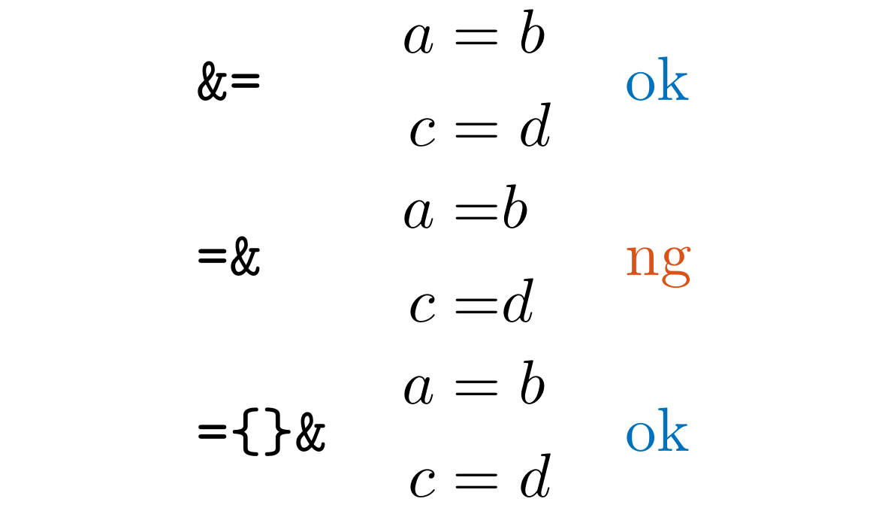
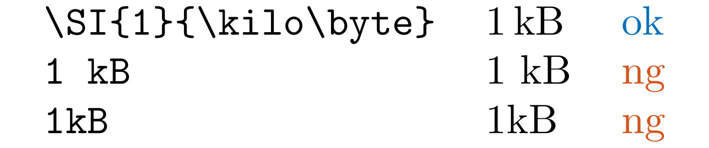

<!-- markdownlint-disable heading-start-left first-line-h1 -->

<div align="center">


# LaTeX Lint

</div>

## Features

This extension provides a LaTeX Linter for `.tex` and `.md` files with the commands renaming feature.


In some aspects, our extension resembles a LaTeX package [chktex](https://ctan.org/pkg/chktex) and a VSCode Extension [LaTeX Begin End Auto Rename](https://marketplace.visualstudio.com/items?itemName=wxhenry.latex-begin-end-auto-rename).
We sincerely appreciate the developers of these extensions.

## Rules

Here is the list of rules we detect.

* [LLAlignAnd](#llalignand) (detect `=&`)
* [LLColonEqq](#llcoloneqq) (detect `:=`, `=:`,`::=`, and `=::`)
* [LLColonInMath](#llcoloninmath) (detect `:` in math mode)
* [LLCref](#llcref) (detect `\ref`)
* [LLDoubleQuotation](#lldoublequotation) (detect `“`, `”` and `"` )
* [LLENDash](#llendash) (detect the dubious use of hyphens)
* [LLNonASCII](#llnonascii) (detect all non-ASCII characters)
* [LLSI](#llsi) (detect `KB`, `MB`, `GB`, etc. without `\SI`)
* [LLT](#llt) (detect `^T`)
* [LLTitle](#lltitle) (detect wrong title case in `\title{}`, `\section{}`, etc.)
* [LLUserDefine](#lluserdefine) (detect Regexes in `latexlint.userDefinedRules`)

### LLAlignAnd

Detect `=&` in `.tex` or `.md` files.
You should likely write as `={}&`.
This pattern should appear only in math mode.

We use the following regex to detect this pattern with some spaces.

```txt
=[\t ]*&
```



[Ref by Stack Exchange](https://tex.stackexchange.com/questions/41074/relation-spacing-error-using-in-aligned-equations)

### LLColonEqq

Detect `:=`, `=:`,`::=`, and `=::` in `.tex` files.
Use `\coloneqq`, `\eqqcolon`, `\Coloneqq` and `\Eqqcolon` in [mathtools](https://ctan.org/pkg/mathtools) package instead.

The colon is slightly too low in `:=`, but vertically centered in `\coloneqq` according to [this](https://tex.stackexchange.com/questions/4216/how-to-typeset-correctly).

[Ref by Stack Exchange](https://tex.stackexchange.com/questions/121363/what-is-the-latex-code-for-the-symbol-two-colons-and-equals-sign).

### LLColonInMath

TODO

Detect ":" in math mode.
You likely want to use `\colon` instead.


### LLCref

Detect `\ref` in `.tex` files.

Use `\cref` or `\Cref` in [cleveref](https://ctan.org/pkg/cleveref) package instead.

We use the following regex to detect this pattern.

```txt
\\ref(?=\{)
```

I prefer this package because it can automatically add prefixes like "Sec." or "Fig.". We can keep the consistency of the reference format.

For cleveref package, you can also refer to [this page by opt-cp](https://web.archive.org/web/20220616140841/https://opt-cp.com/latex-packages/).

```latex
\usepackage{amsmath,mathtools}
\usepackage{amsthm,thmtools}
\declaretheorem{theorem}
\usepackage{cleveref}
\newcommand{\crefrangeconjunction}{--}
\crefname{equation}{}{}
\Crefname{equation}{Eq.}{Eqs.}
\crefname{theorem}{Theorem}{Theorems}
```

### LLDoubleQuotation

Detect `“`, `”` and `"` in `.tex` or `.md` files.
These might be used as "XXX" or “XXX”.

Use ``XXX'' instead for double quotation.

As for “XXX”, there is no problem in most cases.
However, I prefer to use ``XXX'' for consistency.

You can also use `\enquote{XXX}` with [csquotes](https://ctan.org/pkg/csquotes) package.

[Ref by Stack Exchange](https://tex.stackexchange.com/questions/531/what-is-the-best-way-to-use-quotation-mark-glyphs).

### LLENDash

Detect the dubious use of hyphens in `.tex` or `.md` files.

We use the following regex to detect this pattern.

```txt
[A-Z][a-zA-Z]*[a-z](-[A-Z][a-zA-Z]*[a-z])+
```

Here, `[A-Z][a-zA-Z]*[a-z]` is a word with a capital letter, zero or more letters, and a small letter, assuming that this represents the name of a person.

For example, we detect the following.

* `Erdos-Renyi` (random graph, `Erd\H{o}s--R\'enyi`)
* `Einstein-Podolsky-Rosen` (quantum mechanics, `Einstein--Podolsky--Rosen`)
* `Fruchterman-Reingold` (graph drawing, `Fruchterman--Reingold`)
* `Gauss-Legendre` (numerical integration, `Gauss--Legendre`)
* `Gibbs-Helmholtz` (thermodynamics, `Gibbs--Helmholtz`)
* `Karush-Kuhn-Tucker` (optimization, `Karush--Kuhn--Tucker`)

However, we do not detect the following as an exception.

* `Fritz-John` (optimization, name of a person)
* (ToDo: add more examples)

We might have false positives, such as `Wrong-Example`, which is not a person's name.

As a side note, we should use `--` instead of `-` to indicate a range of pages, e.g., `123--456` instead of `123-456`.
We do not detect this because it might be just a subtraction.

### LLNonASCII

Detect all fullwidth ASCII characters in `.tex` or `.md` files.

```txt
[\u3000\uFF01-\uFF5E]
```

> Range U+FF01–FF5E reproduces the characters of ASCII 21 to 7E as fullwidth forms. U+FF00 does not correspond to a fullwidth ASCII 20 (space character), since that role is already fulfilled by U+3000 "ideographic space".
[WikiPedia](https://en.wikipedia.org/wiki/Halfwidth_and_Fullwidth_Forms_(Unicode_block))

We detect the following characters.

```txt
 ！＂＃＄％＆＇（）＊＋，－．／０１２３４５６７
８９：；＜＝＞？＠ＡＢＣＤＥＦＧＨＩＪＫＬＭＮＯ
ＰＱＲＳＴＵＶＷＸＹＺ［＼］＾＿｀ａｂｃｄｅｆｇ
ｈｉｊｋｌｍｎｏｐｑｒｓｔｕｖｗｘｙｚ｛｜｝～
```

If you want to detect all non-ASCII characters, use the following regex.

```txt
[^\x00-\x7F]
```

`\x00` to `\x7F` are ASCII characters.

For example, you can detect the following Japanese characters.

```txt
あア亜、。
```

### LLSI

Detect `KB`, `MB`, `GB`, `TB`, `PB`, `EB`, `ZB`, `YB`, `KiB`, `MiB`, `GiB`, `TiB`, `PiB`, `EiB`, `ZiB`, and `YiB` without `\SI` in `.tex` files.

We use the following regex to detect this pattern.

```txt
(?<![a-zA-Z])(?i:KB|MB|GB|TB|PB|EB|ZB|YB|KiB|MiB|GiB|TiB|PiB|EiB|ZiB|YiB)(?![a-zA-Z])
```

Here (?<!...) and (?!...) are negative lookbehind and negative lookahead assertions, respectively.
Before the unit, there should not be any alphabet.
After the unit, there should not be any alphabet.

Use `\SI` instead for units, like `\SI{1}{\kilo\byte}`(10^3byte) or `\SI{1}{\kibi\byte}`(2^10byte).



| Prefix  | Command  | Symbol  | Power | Prefix  | Command  | Symbol  | Power|
|:-------:|:--------:|:-------:|:-----:|:-------:|:--------:|:-------:|:----:|
|  kilo   |  \kilo   |    k    |   3   |  kibi   |  \kibi   |   Ki    |  10  |
|  mega   |  \mega   |    M    |   6   |  mebi   |  \mebi   |   Mi    |  20  |
|  giga   |  \giga   |    G    |   9   |  gibi   |  \gibi   |   Gi    |  30  |
|  tera   |  \tera   |    T    |  12   |  tebi   |  \tebi   |   Ti    |  40  |
|  peta   |  \peta   |    P    |  15   |  pebi   |  \pebi   |   Pi    |  50  |
|  exa    |  \exa    |    E    |  18   |  exbi   |  \exbi   |   Ei    |  60  |
|  zetta  |  \zetta  |    Z    |  21   |  zebi   |  \zebi   |   Zi    |  70  |
|  yotta  |  \yotta  |    Y    |  24   |  yobi   |  \yobi   |   Yi    |  80  |

It would be better to use `\SI` for units such as `m`, `s`, `kg`, `A`, `K`, `mol`, and `rad`.

[CTAN: siunitx](https://ctan.org/pkg/siunitx)

### LLT

Detect `^T` in `.tex` or `.md` files.
You likely want to use `^\top` or `^\mathsf{T}` instead to represent the transpose of a matrix or a vector. Otherwise, we cannot distinguish between the transpose and the power by a variable `T`.
This pattern should appear only in math mode.

[Ref by BrownieAlice](https://blog.browniealice.net/post/latex_transpose/).

### LLTitle

Title name in `\title{}`, `\section{}`, `\subsection{}`, `\subsubsection{}`, `\paragraph{}`, and `\subparagraph{}` should be in title case in `.tex` files.

It is very difficult to detect all non-title cases because of the many exceptions and styles.
We highly recommend using [Title Case Converter](https://titlecaseconverter.com/) or [Capitalize My Title](https://capitalizemytitle.com/) to convert the title in your preferred style.

We test the string inside the `{}` is invariant by the function `toTitleCase` implemented based on [to-title-case](https://github.com/gouch/to-title-case/tree/master), JavaScript library. There might be some false positives and negatives.

[APA Style](https://apastyle.apa.org/style-grammar-guidelines/capitalization/title-case).

[Ref by WORDVICE](https://blog.wordvice.jp/title-capitalization-rules-for-research-papers/).

### LLUserDefine

You can define your own regular expressions to detect in `.tex` or `.md` files.

In `latexlint.userDefinedRules` in `settings.json`, you can define your own regular expressions.

For example, when you use English letters in math mode for an explanation, you should use `\mathrm`.
If $\mathrm{a}$ is not variables and represents something like **a**tractive force, $f^a(x)$ should be written as $f^{\mathrm{a}}(x)$.

However, it is difficult to detect without context. You can define the following regular expression to detect this pattern.

```txt
f\^a
```

You can easily add your rules by using the `latexlint.addRule` command in the command palette (`Ctrl`+`Shift`+`P`).

<!--

### LLMathSpace

Detect spaces in math mode.

### LLTilde

A tilde should be placed before a `\cite`,`\citet` command.

### LLArrow

Detect `->` and `<-` in `tikzpicture` environment.
It might be better to use `-Latex` and `Latex-` instead.

### LLEtAl

Detect `et al.`.
In most cases, you can use `\citep` instead.

-->

## Rename

You can rename the command by pressing `F2` on the command in `\begin{}` and `\end{}` in `.tex` or `.md` files.

Refer to the GIF animation at [Features](#features).

## Release Notes

Refer to [CHANGELOG.md](CHANGELOG.md).

## License

We use [MIT License](LICENSE).

(The library [to-title-case](https://github.com/gouch/to-title-case/tree/master) is also under MIT License.)
