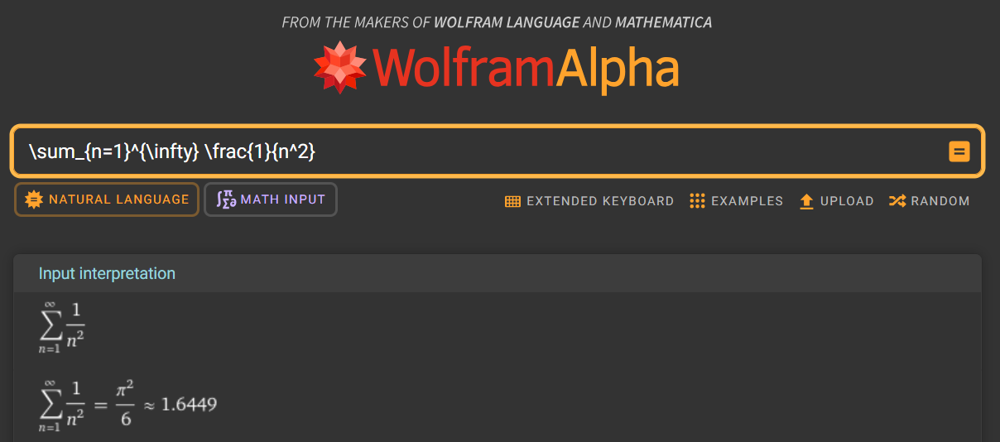

# Sample Document

## Sample Section

$$
\begin{equation}
a = b  \tag{1}
\end{equation}
$$

$$
\begin{equation*}
c = d
\end{equation*}
$$

$$
\begin{align}
    e & = \begin{dcases}
              f & \text{if } g = h \\
              i & \text{if } j = k
          \end{dcases} \\
    l & = m \notag
\end{align}
$$

**Figure 1:** Sample Figure

Sample figure is shown in Figure 1.

## Ask Wolfram Alpha

Select a line. Then, press `Ctrl + Shift + P` and type `askWolframAlpha`.

$$
\begin{gather*}
    \sum_{n=1}^{\infty} \frac{1}{n^2} \\
    \int_{-\infty}^{\infty} e^{-x^2} \mathrm{d} x \\
    \left(1+\left(1+\left(1+x\right)^2\right)^2\right)
\end{gather*}
$$

The Wolfram Alpha page with adjusted expressions will open as in Figure 2.

**Figure 2:** Wolfram Alpha
